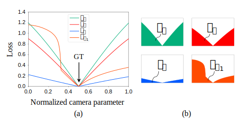
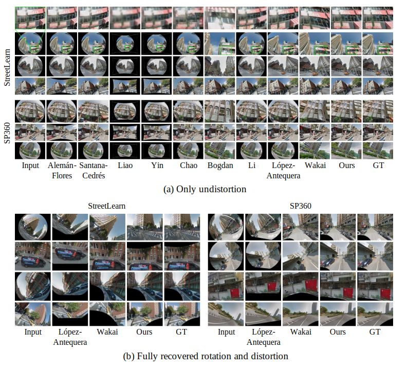

# Rethinking Generic Camera Models for Deep Single Image Camera Calibration to Recover Rotation and Fisheye Distortion

<p align="center">
  <a href="https://tech-ai.panasonic.com/en/researcher_introduction/050/">Nobuhiko Wakai </a><sup>1,*</sup>, 
  Satoshi Sato <sup>1</sup>, 
  <a href="https://tech-ai.panasonic.com/en/researcher_introduction/003/">Yasunori Ishii </a><sup>1</sup>, 
  <a href="http://mprg.cs.chubu.ac.jp/~takayoshi/">Takayoshi Yamashita </a><sup>2</sup><br>
  1 Panasonic Holdings, 2 Chubu University<br>
  * wakai.nobuhiko[at]jp.panasonic.com<br>
  <br>
  European Conference on Computer Vision (ECCV) 2022
</p>

日本語のプロジェクトページは[[こちら]](./README_jp.md)

## Abstract
<a href="https://tech-ai.panasonic.com/en/researcher_introduction/050/"></a>Although recent learning-based calibration methods can predict extrinsic and intrinsic camera parameters from a single image, the accuracy of these methods is degraded in fisheye images. This degradation is caused by mismatching between the actual projection and expected projection. To address this problem, we propose a generic camera model that has the potential to address various types of distortion. Our generic camera model is utilized for learning-based methods through a closed-form numerical calculation of the camera projection. Simultaneously to recover rotation and fisheye distortion, we propose a learning-based calibration method that uses the camera model. Furthermore, we propose a loss function that alleviates the bias of the magnitude of errors for four extrinsic and intrinsic camera parameters. Extensive experiments demonstrated that our proposed method outperformed conventional methods on two large-scale datasets and images captured by off-the-shelf fisheye cameras. Moreover, we are the first researchers to analyze the performance of learning-based methods using various types of projection for off-the-shelf cameras.

## Background
Camera calibration is used for various computer vision tasks to recover camera rotation and fisheye distortion. However, conventional geometric-based calibration methods need a calibration object, such as a plane or a cube. To address this problem, we use learning-based calibration methods called “Deep Single Image Camera Calibration.”

## Contributions
- We propose a learning-based calibration method for recovering camera rotation and fisheye distortion using the proposed generic camera model that has an adaptive ability for off-the-shelf fisheye cameras. To the best of our knowledge, we are the first researchers to calibrate extrinsic and intrinsic parameters of generic camera models addressing various types of projection in off-the-shelf fisheye cameras from a single image.

- We propose a new loss function that alleviates the bias of the magnitude of errors between the ground-truth and predicted camera parameters for four extrinsic and intrinsic parameters to obtain accurate camera parameters.

- We first analyze the performance of learning-based methods using off-the-shelf fisheye cameras consisting of four types of fisheye projection: stereographic projection, equidistance projection, equisolid angle projection, and orthogonal projection.

## Our proposed method
<p align="center">
  
</p>

**Fig. 1:** Concept illustrations of our work. Our network predicts parameters in our proposed generic camera model to obtain fully recovered images using remapping. Red lines indicate horizontal lines in each of the images, for which we used [46]. This figure is referred to in our ECCV2022 Figure 1.
<br>
<br>
### Proposed camera model
Conventional generic camera models [30], given by
$$\gamma = \tilde{k_1} \eta + \tilde{k_2} \eta ^3 + \cdots,$$  
where $\eta$ is an incident angle, $\tilde{k}$ is a distortion coefficient, and $\gamma$ is the distance between a projected point and the principal point on the image sensor.

We propose a generic camera model for learning-based fisheye calibration
using explicit focal length, given by
$$\gamma = f(\eta + k_1 \eta ^3),$$
where $f$ is the focal length, $k_1$ is a distortion coefficient. This generic camera model is a third-order polynomial function corresponding to the Taylor series expansion of the trigonometric function in the fisheye camera. Our model has two advantages: 1) our model precisely represents standard fisheye camera models with slight errors, and 2) our camera parameter ranges can be determined by lens specifications and coefficients of the Taylor series expansion.

### Proposed calibration method
To calibrate various fisheye cameras, we propose a learning-based calibration method that uses our generic camera model, as shown in Figure 1.

### Harmonic non-grid bearing loss
<p align="center">
  
</p>

**Fig. 2:** Difference between the non-grid bearing loss functions [60] for the camera parameters. (a) Each loss landscape along the normalized camera parameters using a predicted camera parameter with a subscript parameter and ground-truth parameters for the remaining parameters, and the ground-truth values are set to 0.5. (b) Areas $S$ calculated using the integral of $L$ with respect to $\theta$, $\psi$, $f$, and $k_1$ from 0 to 1. This figure is referred to in our ECCV2022 Figure 2.
<br>
<br>

Wakai et al. proposed the non-grid bearing loss function [60] evaluating distances on a unit sphere for fisheye camera calibration. However, the joint weights need to be determined. To address this problem, we propose harmonic non-grid bearing loss described below. The joint loss [60] is defined as $$L = w_{\theta}L_{\theta} + w_{\psi}L_{\psi} + w_{f}L_{f} + w_{k_1}L_{k_1},$$ where $w_{\theta}$, $w_{\psi}$, $w_f$, and $w_{k_1}$ are the joint weights of $\theta$, $\psi$, $f$, and $k_1$, respectively. We found that numerical simulations instead of training can analyze loss landscapes. The landscapes express the magnitude of loss values. The optimal joint loss weights $w$ are estimated as follows: We calculate areas $S$ under the loss function $L$ for $\theta$, $\psi$, $f$, and $k_1$ with assuming the ground-truth values to 0.5 in Figure 2 (a). This area $S$ is calculated using the integral of $L$ from 0 to 1, in Figure 2 (b) and is given by
$$S_{\alpha} = \int_0^1 L_\alpha d\alpha,$$
$$L_\alpha = \frac{1}{n}\sum_{i=1}^{n} \rm{Huber}(||p_{\alpha,i} - \hat{p_i}||_{2}),$$
where $n$ is the number of sampling points; $\alpha$ is a parameter, $\alpha$ = { $\theta$, $\psi$, $f$, $k_1$ }; $p$ is a projected world coordinate using a predicted parameter $\alpha$ and ground-truth values for the remaining parameters; and $\hat{p}$ is the ground-truth value of world coordinates $p$. The $\rm{Huber}$ denotes the Huber loss function with $\delta = 1$ [28].

These areas $S$ represent the magnitude of each loss for $\theta$, $\psi$, $f$, and $k_1$. Finally, we define the joint weights $w$ using normalization,
$$w_{\alpha} = \tilde{w}_{\alpha} / W,$$


where $\tilde{w_{\alpha}}$ = 1 / $S_{\alpha}$ and $W$ = $\sum_{\alpha} \tilde{w}_{\alpha}$.  We call a loss function using the weights "harmonic non-grid bearing loss (HNGBL)." Our joint weights can alleviate the bias of the magnitude of the loss for camera parameters. Remarkably, we determine these weights before training.

## Experiments
We used two large-scale datasets of outdoor panoramas called the StreetLearn dataset (Manhattan 2019 subset) [46] and the SP360 dataset [12] for our evaluation.
<br>

### Parameter and reprojection errors
Comparison of the absolute parameter errors and reprojection errors (REPE) on the test set for our generic camera model
<table class="tg">
<thead>
  <tr>
    <th class="tg-c3ow"></th>
    <th align="center" class="tg-c3ow" colspan="5">StreetLearn</th>
    <th align="center" class="tg-c3ow" colspan="5">SP360</th>
  </tr>
</thead>
<tbody>
  <tr>
    <td align="center" class="tg-c3ow">Method</td>
    <td align="center" class="tg-c3ow" colspan="4">Mean absolute error&darr;</td>
    <td align="center" class="tg-c3ow">REPE&darr;</td>
    <td align="center" class="tg-c3ow" colspan="4">Mean absolute error&darr;</td>
    <td align="center" class="tg-c3ow">REPE&darr;</td>
  </tr>
  <tr>
    <td class="tg-c3ow"></td>
    <td align="center" class="tg-c3ow">Tilt [deg]</td>
    <td align="center" class="tg-c3ow">Roll [deg]</td>
    <td align="center" class="tg-c3ow">$f$ [mm]</td>
    <td align="center" class="tg-c3ow">$k_1$</td>
    <td class="tg-c3ow"></td>
    <td align="center" class="tg-c3ow">Tilt [deg]</td>
    <td align="center" class="tg-c3ow">Roll [deg]</td>
    <td align="center" class="tg-c3ow">$f$ [mm]</td>
    <td align="center" class="tg-c3ow">$k_1$</td>
    <td align="center" class="tg-c3ow"></td>
  </tr>
  <tr>
    <td class="tg-c3ow">Lopez-A. [45]</td>
    <td class="tg-c3ow">27.60</td>
    <td class="tg-c3ow">44.90</td>
    <td class="tg-c3ow">2.32</td>
    <td class="tg-c3ow">-</td>
    <td class="tg-c3ow">81.99</td>
    <td class="tg-c3ow">28.66</td>
    <td class="tg-c3ow">44.45</td>
    <td class="tg-c3ow">3.26</td>
    <td class="tg-c3ow">-</td>
    <td class="tg-c3ow">84.56</td>
  </tr>
  <tr>
    <td class="tg-c3ow">Wakai [60]</td>
    <td class="tg-c3ow">10.70</td>
    <td class="tg-c3ow">14.97</td>
    <td class="tg-c3ow">2.73</td>
    <td class="tg-c3ow">-</td>
    <td class="tg-c3ow">30.02</td>
    <td class="tg-c3ow">11.12</td>
    <td class="tg-c3ow">17.70</td>
    <td class="tg-c3ow">2.67</td>
    <td class="tg-c3ow">-</td>
    <td class="tg-c3ow">32.01</td>
  </tr>
  <tr>
    <td class="tg-c3ow">Ours w/o HNGBL<sup>1</sup></td>
    <td class="tg-c3ow">7.23</td>
    <td class="tg-c3ow">7.73</td>
    <td class="tg-c3ow">0.48</td>
    <td class="tg-c3ow">0.025</td>
    <td class="tg-c3ow">12.65</td>
    <td class="tg-c3ow">6.91</td>
    <td class="tg-c3ow">8.61</td>
    <td class="tg-c3ow">0.49</td>
    <td class="tg-c3ow">0.030</td>
    <td class="tg-c3ow">12.57</td>
  </tr>
  <tr>
    <td class="tg-c3ow">Ours</td>
    <td class="tg-c3ow"><b>4.13</b></td>
    <td class="tg-c3ow"><b>5.21</b></td>
    <td class="tg-c3ow"><b>0.34</b></td>
    <td class="tg-c3ow"><b>0.021</b></td>
    <td class="tg-c3ow"><b>7.39</b></td>
    <td class="tg-c3ow"><b>3.75</b></td>
    <td class="tg-c3ow"><b>5.19</b></td>
    <td class="tg-c3ow"><b>0.39</b></td>
    <td class="tg-c3ow"><b>0.023</b></td>
    <td class="tg-c3ow"><b>7.39</b></td>
  </tr>
</tbody>
</table>
1 "Ours w/o HNGBL" refers to replacing HNGBL with non-grid bearing loss [60]<br>
<br>

### Comparison using PSNR and SSIM on our generic camera model
Comparison of mean PSNR and SSIM on the test set for our generic camera model
<table class="tg">
<thead>
  <tr>
    <th class="tg-c3ow"></th>
    <th class="tg-c3ow" colspan="6">StreetLearn</th>
    <th class="tg-c3ow" colspan="6">SP360</th>
  </tr>
</thead>
<tbody>
  <tr>
    <td align="center" class="tg-c3ow">Method</td>
    <td align="center"　　class="tg-c3ow" colspan="3">PSNR&uarr;</td>
    <td align="center" class="tg-c3ow" colspan="3">SSIM&uarr;</td>
    <td align="center" class="tg-c3ow" colspan="3">PSNR&uarr;</td>
    <td align="center" class="tg-c3ow" colspan="3">SSIM&uarr;</td>
  </tr>
  <tr>
    <td class="tg-c3ow"></td>
    <td align="center" class="tg-c3ow">Diag<sup>1</sup></td>
    <td align="center" class="tg-c3ow">Circ<sup>1</sup></td>
    <td align="center" class="tg-c3ow">All</td>
    <td align="center" class="tg-c3ow">Diag</td>
    <td align="center" class="tg-c3ow">Circ</td>
    <td align="center" class="tg-c3ow">All</td>
    <td align="center" class="tg-c3ow">Diag</td>
    <td align="center" class="tg-c3ow">Circ</td>
    <td align="center" class="tg-c3ow">All</td>
    <td align="center" class="tg-c3ow">Diag</td>
    <td align="center" class="tg-c3ow">Circ</td>
    <td align="center" class="tg-c3ow">All</td>
  </tr>
  <tr>
    <td class="tg-c3ow">Alemán-F. [2]</td>
    <td class="tg-c3ow">14.79</td>
    <td class="tg-c3ow">11.70</td>
    <td class="tg-c3ow">13.25</td>
    <td class="tg-c3ow">0.354</td>
    <td class="tg-c3ow">0.271</td>
    <td class="tg-c3ow">0.313</td>
    <td class="tg-c3ow">14.57</td>
    <td class="tg-c3ow">11.03</td>
    <td class="tg-c3ow">12.82</td>
    <td class="tg-c3ow">0.408</td>
    <td class="tg-c3ow">0.311</td>
    <td class="tg-c3ow">0.360</td>
  </tr>
  <tr>
    <td class="tg-c3ow">Santana-C. [55]</td>
    <td class="tg-c3ow">16.27</td>
    <td class="tg-c3ow">13.17</td>
    <td class="tg-c3ow">14.65</td>
    <td class="tg-c3ow">0.384</td>
    <td class="tg-c3ow">0.306</td>
    <td class="tg-c3ow">0.341</td>
    <td class="tg-c3ow">16.06</td>
    <td class="tg-c3ow">12.38</td>
    <td class="tg-c3ow">14.26</td>
    <td class="tg-c3ow">0.438</td>
    <td class="tg-c3ow">0.343</td>
    <td class="tg-c3ow">0.390</td>
  </tr>
  <tr>
    <td class="tg-c3ow">Liao [37]</td>
    <td class="tg-c3ow">13.92</td>
    <td class="tg-c3ow">13.48</td>
    <td class="tg-c3ow">13.71</td>
    <td class="tg-c3ow">0.355</td>
    <td class="tg-c3ow">0.369</td>
    <td class="tg-c3ow">0.362</td>
    <td class="tg-c3ow">14.08</td>
    <td class="tg-c3ow">13.61</td>
    <td class="tg-c3ow">13.85</td>
    <td class="tg-c3ow">0.401</td>
    <td class="tg-c3ow">0.408</td>
    <td class="tg-c3ow">0.404</td>
  </tr>
  <tr>
    <td class="tg-c3ow">Yin [66]</td>
    <td class="tg-c3ow">14.24</td>
    <td class="tg-c3ow">13.57</td>
    <td class="tg-c3ow">13.91</td>
    <td class="tg-c3ow">0.344</td>
    <td class="tg-c3ow">0.354</td>
    <td class="tg-c3ow">0.349</td>
    <td class="tg-c3ow">14.37</td>
    <td class="tg-c3ow">13.68</td>
    <td class="tg-c3ow">14.03</td>
    <td class="tg-c3ow">0.389</td>
    <td class="tg-c3ow">0.391</td>
    <td class="tg-c3ow">0.390</td>
  </tr>
  <tr>
    <td class="tg-c3ow">Chao [13]</td>
    <td class="tg-c3ow">17.36</td>
    <td class="tg-c3ow">14.89</td>
    <td class="tg-c3ow">16.13</td>
    <td class="tg-c3ow">0.439</td>
    <td class="tg-c3ow">0.378</td>
    <td class="tg-c3ow">0.409</td>
    <td class="tg-c3ow">17.23</td>
    <td class="tg-c3ow">14.86</td>
    <td class="tg-c3ow">15.88</td>
    <td class="tg-c3ow">0.480</td>
    <td class="tg-c3ow">0.417</td>
    <td class="tg-c3ow">0.449</td>
  </tr>
  <tr>
    <td class="tg-c3ow">Bogdan [8]</td>
    <td class="tg-c3ow">14.81</td>
    <td class="tg-c3ow">14.32</td>
    <td class="tg-c3ow">14.57</td>
    <td class="tg-c3ow">0.360</td>
    <td class="tg-c3ow">0.353</td>
    <td class="tg-c3ow">0.356</td>
    <td class="tg-c3ow">17.82</td>
    <td class="tg-c3ow">16.20</td>
    <td class="tg-c3ow">17.02</td>
    <td class="tg-c3ow">0.517</td>
    <td class="tg-c3ow">0.459</td>
    <td class="tg-c3ow">0.488</td>
  </tr>
  <tr>
    <td class="tg-c3ow">Li (GeoNetS-&szlig;) [34]</td>
    <td class="tg-c3ow">18.77</td>
    <td class="tg-c3ow">15.15</td>
    <td class="tg-c3ow">16.98</td>
    <td class="tg-c3ow">0.529</td>
    <td class="tg-c3ow">0.410</td>
    <td class="tg-c3ow">0.470</td>
    <td class="tg-c3ow">18.76</td>
    <td class="tg-c3ow">15.13</td>
    <td class="tg-c3ow">16.97</td>
    <td class="tg-c3ow">0.572</td>
    <td class="tg-c3ow">0.452</td>
    <td class="tg-c3ow">0.513</td>
  </tr>
  <tr>
    <td class="tg-c3ow">López-A. [45]</td>
    <td class="tg-c3ow">19.17</td>
    <td class="tg-c3ow">16.58</td>
    <td class="tg-c3ow">17.88</td>
    <td class="tg-c3ow">0.547</td>
    <td class="tg-c3ow">0.449</td>
    <td class="tg-c3ow">0.499</td>
    <td class="tg-c3ow">17.72</td>
    <td class="tg-c3ow">14.73</td>
    <td class="tg-c3ow">16.24</td>
    <td class="tg-c3ow">0.542</td>
    <td class="tg-c3ow">0.429</td>
    <td class="tg-c3ow">0.486</td>
  </tr>
  <tr>
    <td class="tg-c3ow">Wakai [60]</td>
    <td class="tg-c3ow">21.12</td>
    <td class="tg-c3ow">22.04</td>
    <td class="tg-c3ow">21.57</td>
    <td class="tg-c3ow">0.604</td>
    <td class="tg-c3ow">0.640</td>
    <td class="tg-c3ow">0.622</td>
    <td class="tg-c3ow">21.03</td>
    <td class="tg-c3ow">20.93</td>
    <td class="tg-c3ow">20.98</td>
    <td class="tg-c3ow">0.640</td>
    <td class="tg-c3ow">0.637</td>
    <td class="tg-c3ow">0.639</td>
  </tr>
  <tr>
    <td class="tg-c3ow">Ours w/o HNGBL<sup>2</sup></td>
    <td class="tg-c3ow">27.12</td>
    <td class="tg-c3ow">27.70</td>
    <td class="tg-c3ow">27.41</td>
    <td class="tg-c3ow">0.801</td>
    <td class="tg-c3ow">0.801</td>
    <td class="tg-c3ow">0.801</td>
    <td class="tg-c3ow">25.93</td>
    <td class="tg-c3ow">27.07</td>
    <td class="tg-c3ow">26.49</td>
    <td class="tg-c3ow">0.790</td>
    <td class="tg-c3ow">0.812</td>
    <td class="tg-c3ow">0.801</td>
  </tr>
  <tr>
    <td class="tg-c3ow">Ours</td>
    <td class="tg-c3ow"><b>28.39</b></td>
    <td class="tg-c3ow"><b>29.63</b></td>
    <td class="tg-c3ow"><b>29.01</b></td>
    <td class="tg-c3ow"><b>0.828</b></td>
    <td class="tg-c3ow"><b>0.847</b></td>
    <td class="tg-c3ow"><b>0.838</b></td>
    <td class="tg-c3ow"><b>27.19</b></td>
    <td class="tg-c3ow"><b>29.03</b></td>
    <td class="tg-c3ow"><b>28.10</b></td>
    <td class="tg-c3ow"><b>0.819</b></td>
    <td class="tg-c3ow"><b>0.852</b></td>
    <td class="tg-c3ow"><b>0.835</b></td>
  </tr>
</tbody>
</table>
1 Diag denotes evaluation using only diagonal fisheye images; Circ denotes evaluation using only circumferential fisheye images<br>
2 "Ours w/o HNGBL" refers to replacing HNGBL with non-grid bearing loss [60]<br>
<br>

### Comparison of PSNR on the trigonometric function models
Comparison of mean PSNR on the test set for the trigonometric function models
<table class="tg">
<thead>
  <tr>
    <th class="tg-c3ow"></th>
    <th align="center" class="tg-c3ow" colspan="5">StreetLearn</th>
    <th align="center" class="tg-c3ow" colspan="5">SP360</th>
  </tr>
</thead>
<tbody>
  <tr>
    <td align="center" class="tg-c3ow">Method</td>
    <td align="center" class="tg-c3ow">Stereo-<br>graphic</td>
    <td align="center" class="tg-c3ow">Equi-<br>distance</td>
    <td align="center" class="tg-c3ow">Equisolid<br>angle</td>
    <td align="center" class="tg-c3ow">Ortho-<br>gonal</td>
    <td align="center" class="tg-c3ow">All</td>
    <td align="center" class="tg-c3ow">Stereo-<br>graphic</td>
    <td align="center" class="tg-c3ow">Equi-<br>distance</td>
    <td align="center" class="tg-c3ow">Equisolid<br>angle</td>
    <td align="center" class="tg-c3ow">Ortho-<br>gonal</td>
    <td align="center" class="tg-c3ow">All</td>
  </tr>
  <tr>
    <td class="tg-c3ow">Alemán-F. [2]</td>
    <td class="tg-c3ow">13.23</td>
    <td class="tg-c3ow">12.25</td>
    <td class="tg-c3ow">11.70</td>
    <td class="tg-c3ow">9.72</td>
    <td class="tg-c3ow">11.72</td>
    <td class="tg-c3ow">12.89</td>
    <td class="tg-c3ow">11.69</td>
    <td class="tg-c3ow">10.99</td>
    <td class="tg-c3ow">8.53</td>
    <td class="tg-c3ow">11.03</td>
  </tr>
  <tr>
    <td class="tg-c3ow">Santana-C. [55]</td>
    <td class="tg-c3ow">14.68</td>
    <td class="tg-c3ow">13.20</td>
    <td class="tg-c3ow">12.49</td>
    <td class="tg-c3ow">10.29</td>
    <td class="tg-c3ow">12.66</td>
    <td class="tg-c3ow">14.25</td>
    <td class="tg-c3ow">12.57</td>
    <td class="tg-c3ow">11.77</td>
    <td class="tg-c3ow">9.34</td>
    <td class="tg-c3ow">11.98</td>
  </tr>
  <tr>
    <td class="tg-c3ow">Liao [37]</td>
    <td class="tg-c3ow">13.63</td>
    <td class="tg-c3ow">13.53</td>
    <td class="tg-c3ow">13.52</td>
    <td class="tg-c3ow">13.74</td>
    <td class="tg-c3ow">13.60</td>
    <td class="tg-c3ow">13.76</td>
    <td class="tg-c3ow">13.66</td>
    <td class="tg-c3ow">13.67</td>
    <td class="tg-c3ow">13.92</td>
    <td class="tg-c3ow">13.75</td>
  </tr>
  <tr>
    <td class="tg-c3ow">Yin [66]</td>
    <td class="tg-c3ow">13.81</td>
    <td class="tg-c3ow">13.62</td>
    <td class="tg-c3ow">13.59</td>
    <td class="tg-c3ow">13.77</td>
    <td class="tg-c3ow">13.70</td>
    <td class="tg-c3ow">13.92</td>
    <td class="tg-c3ow">13.74</td>
    <td class="tg-c3ow">13.72</td>
    <td class="tg-c3ow">13.94</td>
    <td class="tg-c3ow">13.83</td>
  </tr>
  <tr>
    <td class="tg-c3ow">Chao [13]</td>
    <td class="tg-c3ow">15.86</td>
    <td class="tg-c3ow">15.12</td>
    <td class="tg-c3ow">14.87</td>
    <td class="tg-c3ow">14.52</td>
    <td class="tg-c3ow">15.09</td>
    <td class="tg-c3ow">15.60</td>
    <td class="tg-c3ow">15.02</td>
    <td class="tg-c3ow">14.83</td>
    <td class="tg-c3ow">14.69</td>
    <td class="tg-c3ow">15.03</td>
  </tr>
  <tr>
    <td class="tg-c3ow">Bogdan [8]</td>
    <td class="tg-c3ow">14.55</td>
    <td class="tg-c3ow">14.43</td>
    <td class="tg-c3ow">14.46</td>
    <td class="tg-c3ow">14.71</td>
    <td class="tg-c3ow">14.54</td>
    <td class="tg-c3ow">16.92</td>
    <td class="tg-c3ow">16.34</td>
    <td class="tg-c3ow">16.14</td>
    <td class="tg-c3ow">15.65</td>
    <td class="tg-c3ow">16.26</td>
  </tr>
  <tr>
    <td class="tg-c3ow">Li (GeoNetS-&szlig;) [34]</td>
    <td class="tg-c3ow">16.37</td>
    <td class="tg-c3ow">15.41</td>
    <td class="tg-c3ow">15.07</td>
    <td class="tg-c3ow">14.58</td>
    <td class="tg-c3ow">15.36</td>
    <td class="tg-c3ow">16.22</td>
    <td class="tg-c3ow">15.33</td>
    <td class="tg-c3ow">15.04</td>
    <td class="tg-c3ow">14.72</td>
    <td class="tg-c3ow">15.33</td>
  </tr>
  <tr>
    <td class="tg-c3ow">Lopez-A. [45]</td>
    <td class="tg-c3ow">17.84</td>
    <td class="tg-c3ow">16.84</td>
    <td class="tg-c3ow">16.43</td>
    <td class="tg-c3ow">15.15</td>
    <td class="tg-c3ow">16.57</td>
    <td class="tg-c3ow">15.72</td>
    <td class="tg-c3ow">14.94</td>
    <td class="tg-c3ow">14.68</td>
    <td class="tg-c3ow">14.52</td>
    <td class="tg-c3ow">14.97</td>
  </tr>
  <tr>
    <td class="tg-c3ow">Wakai [60]</td>
    <td class="tg-c3ow">22.39</td>
    <td class="tg-c3ow">23.62</td>
    <td class="tg-c3ow">22.91</td>
    <td class="tg-c3ow">17.79</td>
    <td class="tg-c3ow">21.68</td>
    <td class="tg-c3ow">22.29</td>
    <td class="tg-c3ow">22.65</td>
    <td class="tg-c3ow">21.79</td>
    <td class="tg-c3ow">17.54</td>
    <td class="tg-c3ow">21.07</td>
  </tr>
  <tr>
    <td class="tg-c3ow">Ours w/o HNGBL<sup>1</sup></td>
    <td class="tg-c3ow">26.49</td>
    <td class="tg-c3ow">29.08</td>
    <td class="tg-c3ow">28.56</td>
    <td class="tg-c3ow"><b>23.97</b></td>
    <td class="tg-c3ow">27.02</td>
    <td class="tg-c3ow">25.35</td>
    <td class="tg-c3ow">28.53</td>
    <td class="tg-c3ow">28.26</td>
    <td class="tg-c3ow">23.85</td>
    <td class="tg-c3ow">26.50</td>
  </tr>
  <tr>
    <td class="tg-c3ow">Ours</td>
    <td class="tg-c3ow"><b>26.84</b></td>
    <td class="tg-c3ow"><b>30.10</b></td>
    <td class="tg-c3ow"><b>29.69</b></td>
    <td class="tg-c3ow">23.70</td>
    <td class="tg-c3ow"><b>27.58</b></td>
    <td class="tg-c3ow"><b>25.74</b></td>
    <td class="tg-c3ow"><b>29.28</b></td>
    <td class="tg-c3ow"><b>28.95</b></td>
    <td class="tg-c3ow"><b>23.93</b></td>
    <td class="tg-c3ow"><b>26.98</b></td>
  </tr>
</tbody>
</table>
1 "Ours w/o HNGBL" refers to replacing HNGBL with non-grid bearing loss [60]<br>
<br>

### Qualitative results on the synthesis images
<p align="center">
  
</p>

**Fig. 3:** Qualitative results on the test images for our generic camera model. (a) Undistortion results shown in the input image, results of the compared methods (Alemán-Flores [2], Santana-Cedrés [55], Liao [37], Yin [66], Chao [13], Bogdan [8], Li (GeoNetS-&szlig;) [34], López-Antequera [45], and Wakai [60]), our method, and the ground-truth image from left to right. (b) Fully recovered rotation and distortion shown in the input image, results of the compared methods (López-Antequera [45] and Wakai [60]), our method, and the ground-truth image from left to right. This figure is referred to in our ECCV2022 Figure 3.
<br>
<br>

### Qualitative results on the off-the-shelf camera images
<p align="center">
  
</p>

**Fig. 4:** Qualitative results of fully recovering rotation and fisheye distortion for the off-the-shelf cameras shown in the input image, results of the compared methods (López-Antequera [45] and Wakai [60]), and our method from left to right for each image. The IDs correspond to camera IDs in our paper, and the projection names are attached to the IDs from specifications (ID: 3-5) and our estimation (ID: 1, 2, and 6). Qualitative results of the methods trained using StreetLearn [46] and SP360 [12] in (a) and (b), respectively. This figure is referred to in our ECCV2022 Figure 4.
<br>
<br>
These descriptions on this project page are referred to in our ECCV2022.

## Links
- ECCV2022: [[paper]](https://www.ecva.net/papers/eccv_2022/papers_ECCV/papers/136780668.pdf) [[supp]](https://www.ecva.net/papers/eccv_2022/papers_ECCV/papers/136780668-supp.zip) [[poster]](./figure/ECCV2022_Wakai_poster.pdf) [[slide]](./figure/ECCV2022_Wakai_slide.pdf)
- arXiv: [[arXiv]](https://arxiv.org/abs/2111.12927)
- BibTex
```tex
@INPROCEEDINGS{Wakai_2022_ECCV,
    author    = {Wakai, Nobuhiko and Sato, Satoshi and Ishii, Yasunori and Yamashita, Takayoshi},
    title     = {Rethinking Generic Camera Models for Deep Single Image Camera Calibration to Recover Rotation and Fisheye Distortion},
    booktitle = {European Conference on Computer Vision (ECCV)},
    volume    = {13678},
    pages     = {679-698},
    year      = {2022}
}
```
- Related project
    * Nobuhiko Wakai and Takayoshi Yamashita. Deep Single Fisheye Image Camera Calibration for Over 180-degree Projection of Field of View. In International Conference on Computer Vision Workshop (ICCVW), pages 1174-1183, 2021. [[paper]](https://openaccess.thecvf.com/content/ICCV2021W/PBDL/papers/Wakai_Deep_Single_Fisheye_Image_Camera_Calibration_for_Over_180-Degree_Projection_ICCVW_2021_paper.pdf)
    * Nobuhiko Wakai and Satoshi Sato and Yasunori Ishii and Takayoshi Yamashita. Deep Single Image Camera Calibration by Heatmap Regression to Recover Fisheye Images Under Manhattan World Assumption. In IEEE/CVF Conference on Computer Vision and Pattern Recognition (CVPR), pages 11884-11894, 2024. [[paper]](https://openaccess.thecvf.com/content/CVPR2024/papers/Wakai_Deep_Single_Image_Camera_Calibration_by_Heatmap_Regression_to_Recover_CVPR_2024_paper.pdf) [[project]](https://github.com/panasonic-ai/manhattan-deep-calib)
- Press release: [[press]](https://news.panasonic.com/global/press/en220928-2)

## References
- [2] Alemán-Flores, M., Alvarez, L., Gomez, L., Santana-Cedrés, D.: Automatic lens distortion correction using one-parameter division models. Image Processing On Line (IPOL) 4, 327–343 (2014).
- [8] Bogdan, O., Eckstein, V., Rameau, F., Bazin, J.C.: DeepCalib: A deep learning
approach for automatic intrinsic calibration of wide field-of-view cameras. In:
Proceedings of SIGGRAPH European Conference on Visual Media Production
(CVMP) (2018).
- [12] Chang,S.,Chiu,C.,Chang,C.,Chen,K.,Yao,C.,Lee,R.,Chu,H.:Generating360 outdoor panorama dataset with reliable sun position estimation. In: Proceedings of SIGGRAPH Asia. pp. 1–2 (2018).
- [13] Chao, C., Hsu, P., Lee, H., Wang, Y.: Self-supervised deep learning for fisheye
image rectification. In: Proceedings of IEEE International Conference on
Acoustics, Speech, and Signal Processing (ICASSP). pp. 2248–2252 (2020).
- [28] Huber, P.J.: Robust estimation of a location parameter. Annals of Mathematical
Statistics 35(1), 73–101 (1964).
- [30] Kannala, J., Brandt, S.S.: A generic camera model and calibration method
for conventional, wide-angle, and fish-eye lenses. IEEE Transactions on Pattern Analysis and Machine Intelligence (PAMI) 28(8), 1335–1340 (2006).
- [34] Li, X., Zhang, B., Sander, P.V., Liao, J.: Blind geometric distortion correction on images through deep learning. In: Proceedings of IEEE/CVF Conference on Computer Vision and Pattern Recognition (CVPR). pp. 4855–4864 (2019).
- [37] Liao, K., Lin, C., Zhao, Y.: A deep ordinal distortion estimation approach for
distortion rectification. IEEE Transactions on Image Processing (TIP) 30, 3362–
3375 (2021).
- [45] López-Antequera, M., Marí, R., Gargallo, P., Kuang, Y., Gonzalez-Jimenez, J.,
Haro, G.: Deep single image camera calibration with radial distortion. In: Proceedings
of IEEE/CVF Conference on Computer Vision and Pattern Recognition
(CVPR). pp. 11809–11817 (2019).
- [46] Mirowski, P., Banki-Horvath, A., Anderson, K., Teplyashin, D., Hermann, K.M.,
Malinowski, M., Grimes, M.K., Simonyan, K., Kavukcuoglu, K., Zisserman,
A., Hadsell, R.: The StreetLearn environment and dataset. arXiv preprint
arXiv:1903.01292 (2019).
- [55] Santana-Cedrés, D., Gomez, L., Alemán-Flores, M., Salgado, A., Esclarín, J., Mazorra,
L., Alvarez, L.: An iterative optimization algorithm for lens distortion correction
using two-parameter models. Image Processing On Line (IPOL) 6, 326–364
(2016).
- [60] Wakai, N., Yamashita, T.: Deep single fisheye image camera calibration for over
180-degree projection of field of view. In: Proceedings of IEEE/CVF International
Conference on Computer Vision Workshops (ICCVW). pp. 1174–1183 (2021).
- [66] Yin, X., Wang, X., Yu, J., Zhang, M., Fua, P., Tao, D.: FishEyeRecNet: A multicontext
collaborative deep network for fisheye image rectification. In: Proceedings
of European Conference on Computer Vision (ECCV). pp. 475–490 (2018).
