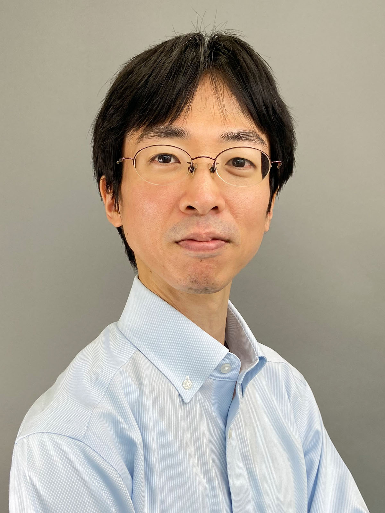
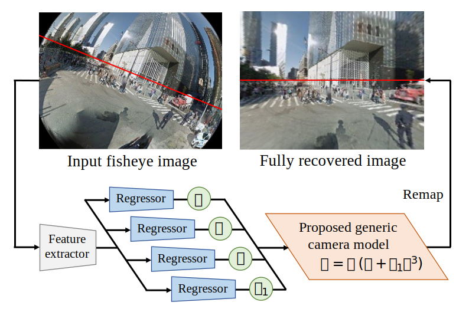
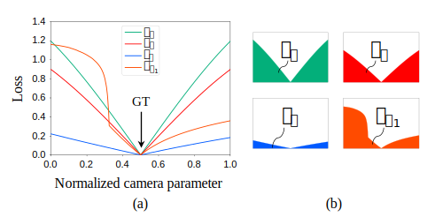
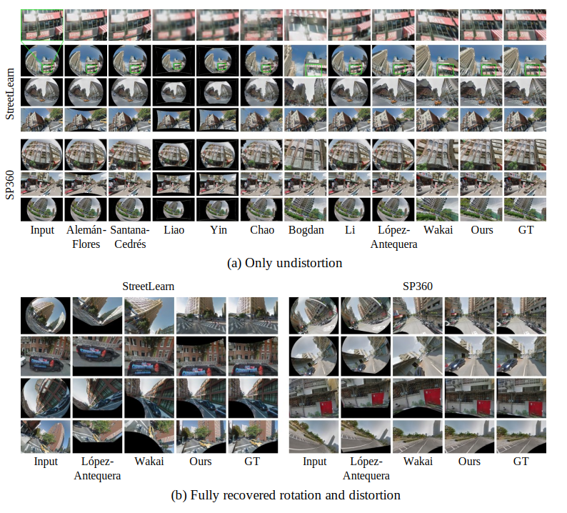
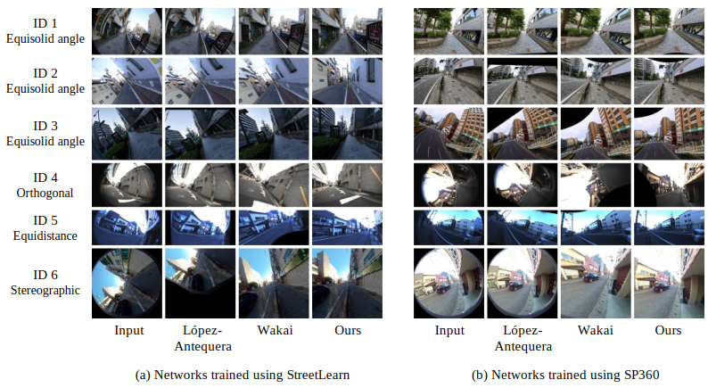

# Rethinking Generic Camera Models for Deep Single Image Camera Calibration to Recover Rotation and Fisheye Distortion

<p align="center">
  <a href="https://tech-ai.panasonic.com/jp/researcher_introduction/050/">若井 信彦 </a><sup>1</sup>, 
  佐藤 智 <sup>1</sup>, 
  <a href="https://tech-ai.panasonic.com/jp/researcher_introduction/003/">石井 育規 </a><sup>1</sup>, 
  山下 隆義 <sup>2</sup><br>
  1 パナソニックホールディングス, 2 中部大学<br>
  <br>
  European Conference on Computer Vision (ECCV) 2022
</p>

English project page is [[here]](./README.md)

## 要旨
<a href="https://tech-ai.panasonic.com/jp/researcher_introduction/050/"></a>最近の学習ベースの校正法は外部と内部のカメラパラメータを一枚の画像から推定できるが、魚眼画像において校正精度が劣化する。この劣化は実際の投影方式と期待する投影方式が合わないことによって生じる。この問題に対処するため、様々な歪みのタイプに対処できる一般カメラモデルを提案する。この一般カメラモデルは閉形式で投影が計算できるので学習ベースの校正法で利用し易い。回転と魚眼歪みを同時に補正するため、このカメラモデルを用いる学習ベースの校正法を提案する。さらに、4つの外部と内部パラメータの誤差の大きさの偏りを軽減するため、ロス関数を提案する。2つの大規模データセットと市販魚眼カメラで撮影した画像における広範な実験において、提案法が従来法を上回った。その上、学習ベース手法の性能を様々なタイプの投影からなる市販カメラで初めて解析した。

## 背景
カメラ校正は様々なコンピュータビジョンのタスクでカメラの回転と魚眼歪みの補正に利用される。しかし、従来の幾何ベースのカメラ校正法は校正指標である板や直方体が必要であり、この課題に対して著者らは深層単画像カメラ校正と呼ばれる学習ベースの校正法を用いる。

## 貢献
- カメラの回転と魚眼歪みを補正する学習ベースの校正法を提案し、市販カメラへの適合性が高い提案一般カメラモデルを用いる。知る限りでは、一枚の画像から様々な市販カメラの投影方式に対応し、外部と内部パラメータを推定する初の手法である。

- 4つの外部と内部パラメータを高精度に得るために、真値と推定値間のロスの大きさの偏りを軽減する新たなロス関数を提案する。

- 立体射影、等距離射影、等立体角射影、正射影からなる4つの魚眼投影方式の市販カメラで、初めて学習ベースの手法を解析する。

## 提案法
<p align="center">
  
</p>

**Fig. 1:** コンセプトのイラスト。著者らのネットワークは画像投影により完全補正された画像を得るために、提案一般カメラモデルのパラメータを推論する。 各画像の赤線は水平線を示し、これらの画像に[46]を用いた。この画像は著名らの論文のFigure 1の引用である。
<br>
<br>
### 提案カメラモデル
従来の3次の一般カメラモデル[30]は、
$$\gamma = \tilde{k_1} \eta + \tilde{k_2} \eta ^3 + \cdots,$$  
ここで、 $f$は焦点距離、 $\tilde{k}$は歪み係数、 $\gamma$は投影点と主点のイメージセンサ上での距離である。

学習ベースの魚眼校正のために、焦点距離を明に用いた一般カメラモデルの提案は、
$$\gamma = f(\eta + k_1 \eta ^3),$$
ここで、 $k_1$は歪み係数である。この一般カメラモデルは3次多項式関数であり魚眼カメラの三角関数のTaylor展開に一致する。著者らのモデルの有利性は2点であり、1) 標準の魚眼カメラモデルをわずかな誤差で高精度に表現でき、2) カメラパラメータの範囲をレンズの設計値とTaylor展開の係数から決定できる。

### 提案カメラ校正法
様々な魚眼カメラを校正するため、Figure 1に示す提案カメラモデルを用いる学習ベースの校正法を提案する。

### Harmonic non-grid bearing loss
<p align="center">
  
</p>

**Fig. 2:** カメラパラメータ間のNon-grid bearing loss function [60]の差異。(a) 正規化したカメラパラメータに沿ったロス地形であり、下添字の推論パラメータとそれ以外は真値0.5を使用する。(b) $L$の0から1の積分による面積 $S$であり、 $\theta$、 $\psi$、 $f$、 $k_1$を変数とする。この画像は著名らの論文のFigure 2の引用である。
<br>
<br>

Wakaiらは単位球面上の距離で評価するNon-grid bearing loss function [60]を提案した。しかし、結合の重みを決定する必要がある。この問題に対処するため、以下に説明するHarmonic non-grid bearing lossを提案する。線形結合のロス関数 [60]は $$L = w_{\theta}L_{\theta} + w_{\psi}L_{\psi} + w_{f}L_{f} + w_{k_1}L_{k_1},$$ここで、 $w_{\theta}$、 $w_{\psi}$、 $w_f$、 $w_{k_1}$はそれぞれ結合の重みの $\theta$、 $\psi$、 $f$、 $k_1$である。 訓練の代わりに数値シミュレーションでロス地形を分析できることを発見した。このロス地形はロスの大きさを表す。最適な結合の重み $w$は以下の手順で推定できる。Figure 2 (a)で示す真値0.5を仮定し、 $\theta$、 $\psi$、 $f$、 $k_1$に関してロス関数 $L$より下の面積 $S$を算出する。Figure 2 (b)示す面積 $S$は $L$を0から1まで積分することで算出でき、
$$S_{\alpha} = \int_0^1 L_\alpha d\alpha,$$
$$L_\alpha = \frac{1}{n}\sum_{i=1}^{n} \rm{Huber}(||p_{\alpha,i} - \hat{p_i}||_{2}),$$
ここで、 $n$はサンプリング点数、 $\alpha$はパラメータ、 $\alpha$ = { $\theta$, $\psi$, $f$, $k_1$ }、 $p$は推論パラメータ $\alpha$とそれ以外に真値を用いた投影世界座標点、 $\hat{p}$は世界座標点 $p$の真値世界座標点。 $\rm{Huber}$は $\delta = 1$のHuberロス関数 [28]である。

これらの面積 $S$は $\theta$、 $\psi$、 $f$、 $k_1$の各ロスの大きさを表す。最終的に、正規化済みの結合の重み $w$の定義は、
$$w_{\alpha} = \tilde{w}_{\alpha} / W,$$

ここで $\tilde{w_{\alpha}}$ = 1 / $S_{\alpha}$、 $W$ = $\sum_{\alpha} \tilde{w}_{\alpha}$である。この重みを用いるロス関数を「Harmonic non-grid bearing loss (HNGBL)」と呼ぶ。 この重みはカメラパラメータ間のロスの大きさの偏りを軽減できる。特筆すべき点は、これらの重みを訓練する前に決定する。

## 実験
屋外パノラマの大規模データセットであるStreetLearn dataset (Manhattan 2019 subset) [46]とSP360 dataset [12]を評価に用いた。
<br>

### パラメータと再投影誤差
提案カメラモデルのテストデータセットにおけるパラメータの絶対値誤差と再投影誤差 (REPE)の比較
<table class="tg">
<thead>
  <tr>
    <th class="tg-c3ow"></th>
    <th align="center" class="tg-c3ow" colspan="5">StreetLearn</th>
    <th align="center" class="tg-c3ow" colspan="5">SP360</th>
  </tr>
</thead>
<tbody>
  <tr>
    <td align="center" class="tg-c3ow">Method</td>
    <td align="center" class="tg-c3ow" colspan="4">Mean absolute error&darr;</td>
    <td align="center" class="tg-c3ow">REPE&darr;</td>
    <td align="center" class="tg-c3ow" colspan="4">Mean absolute error&darr;</td>
    <td align="center" class="tg-c3ow">REPE&darr;</td>
  </tr>
  <tr>
    <td class="tg-c3ow"></td>
    <td align="center" class="tg-c3ow">Tilt [deg]</td>
    <td align="center" class="tg-c3ow">Roll [deg]</td>
    <td align="center" class="tg-c3ow">$f$ [mm]</td>
    <td align="center" class="tg-c3ow">$k_1$</td>
    <td class="tg-c3ow"></td>
    <td align="center" class="tg-c3ow">Tilt [deg]</td>
    <td align="center" class="tg-c3ow">Roll [deg]</td>
    <td align="center" class="tg-c3ow">$f$ [mm]</td>
    <td align="center" class="tg-c3ow">$k_1$</td>
    <td align="center" class="tg-c3ow"></td>
  </tr>
  <tr>
    <td class="tg-c3ow">Lopez-A. [45]</td>
    <td class="tg-c3ow">27.60</td>
    <td class="tg-c3ow">44.90</td>
    <td class="tg-c3ow">2.32</td>
    <td class="tg-c3ow">-</td>
    <td class="tg-c3ow">81.99</td>
    <td class="tg-c3ow">28.66</td>
    <td class="tg-c3ow">44.45</td>
    <td class="tg-c3ow">3.26</td>
    <td class="tg-c3ow">-</td>
    <td class="tg-c3ow">84.56</td>
  </tr>
  <tr>
    <td class="tg-c3ow">Wakai [60]</td>
    <td class="tg-c3ow">10.70</td>
    <td class="tg-c3ow">14.97</td>
    <td class="tg-c3ow">2.73</td>
    <td class="tg-c3ow">-</td>
    <td class="tg-c3ow">30.02</td>
    <td class="tg-c3ow">11.12</td>
    <td class="tg-c3ow">17.70</td>
    <td class="tg-c3ow">2.67</td>
    <td class="tg-c3ow">-</td>
    <td class="tg-c3ow">32.01</td>
  </tr>
  <tr>
    <td class="tg-c3ow">Ours w/o HNGBL<sup>1</sup></td>
    <td class="tg-c3ow">7.23</td>
    <td class="tg-c3ow">7.73</td>
    <td class="tg-c3ow">0.48</td>
    <td class="tg-c3ow">0.025</td>
    <td class="tg-c3ow">12.65</td>
    <td class="tg-c3ow">6.91</td>
    <td class="tg-c3ow">8.61</td>
    <td class="tg-c3ow">0.49</td>
    <td class="tg-c3ow">0.030</td>
    <td class="tg-c3ow">12.57</td>
  </tr>
  <tr>
    <td class="tg-c3ow">Ours</td>
    <td class="tg-c3ow"><b>4.13</b></td>
    <td class="tg-c3ow"><b>5.21</b></td>
    <td class="tg-c3ow"><b>0.34</b></td>
    <td class="tg-c3ow"><b>0.021</b></td>
    <td class="tg-c3ow"><b>7.39</b></td>
    <td class="tg-c3ow"><b>3.75</b></td>
    <td class="tg-c3ow"><b>5.19</b></td>
    <td class="tg-c3ow"><b>0.39</b></td>
    <td class="tg-c3ow"><b>0.023</b></td>
    <td class="tg-c3ow"><b>7.39</b></td>
  </tr>
</tbody>
</table>
1 "Ours w/o HNGBL"はHNGBLをNon-grid bearing loss [60]に置き換え<br>
<br>

### 提案一般カメラモデルのPSNRとSSIM比較
提案カメラモデルのテストデータセットにおける平均PSNRとSSIMの比較
<table class="tg">
<thead>
  <tr>
    <th class="tg-c3ow"></th>
    <th class="tg-c3ow" colspan="6">StreetLearn</th>
    <th class="tg-c3ow" colspan="6">SP360</th>
  </tr>
</thead>
<tbody>
  <tr>
    <td align="center" class="tg-c3ow">Method</td>
    <td align="center"　　class="tg-c3ow" colspan="3">PSNR&uarr;</td>
    <td align="center" class="tg-c3ow" colspan="3">SSIM&uarr;</td>
    <td align="center" class="tg-c3ow" colspan="3">PSNR&uarr;</td>
    <td align="center" class="tg-c3ow" colspan="3">SSIM&uarr;</td>
  </tr>
  <tr>
    <td class="tg-c3ow"></td>
    <td align="center" class="tg-c3ow">Diag<sup>1</sup></td>
    <td align="center" class="tg-c3ow">Circ<sup>1</sup></td>
    <td align="center" class="tg-c3ow">All</td>
    <td align="center" class="tg-c3ow">Diag</td>
    <td align="center" class="tg-c3ow">Circ</td>
    <td align="center" class="tg-c3ow">All</td>
    <td align="center" class="tg-c3ow">Diag</td>
    <td align="center" class="tg-c3ow">Circ</td>
    <td align="center" class="tg-c3ow">All</td>
    <td align="center" class="tg-c3ow">Diag</td>
    <td align="center" class="tg-c3ow">Circ</td>
    <td align="center" class="tg-c3ow">All</td>
  </tr>
  <tr>
    <td class="tg-c3ow">Alemán-F. [2]</td>
    <td class="tg-c3ow">14.79</td>
    <td class="tg-c3ow">11.70</td>
    <td class="tg-c3ow">13.25</td>
    <td class="tg-c3ow">0.354</td>
    <td class="tg-c3ow">0.271</td>
    <td class="tg-c3ow">0.313</td>
    <td class="tg-c3ow">14.57</td>
    <td class="tg-c3ow">11.03</td>
    <td class="tg-c3ow">12.82</td>
    <td class="tg-c3ow">0.408</td>
    <td class="tg-c3ow">0.311</td>
    <td class="tg-c3ow">0.360</td>
  </tr>
  <tr>
    <td class="tg-c3ow">Santana-C. [55]</td>
    <td class="tg-c3ow">16.27</td>
    <td class="tg-c3ow">13.17</td>
    <td class="tg-c3ow">14.65</td>
    <td class="tg-c3ow">0.384</td>
    <td class="tg-c3ow">0.306</td>
    <td class="tg-c3ow">0.341</td>
    <td class="tg-c3ow">16.06</td>
    <td class="tg-c3ow">12.38</td>
    <td class="tg-c3ow">14.26</td>
    <td class="tg-c3ow">0.438</td>
    <td class="tg-c3ow">0.343</td>
    <td class="tg-c3ow">0.390</td>
  </tr>
  <tr>
    <td class="tg-c3ow">Liao [37]</td>
    <td class="tg-c3ow">13.92</td>
    <td class="tg-c3ow">13.48</td>
    <td class="tg-c3ow">13.71</td>
    <td class="tg-c3ow">0.355</td>
    <td class="tg-c3ow">0.369</td>
    <td class="tg-c3ow">0.362</td>
    <td class="tg-c3ow">14.08</td>
    <td class="tg-c3ow">13.61</td>
    <td class="tg-c3ow">13.85</td>
    <td class="tg-c3ow">0.401</td>
    <td class="tg-c3ow">0.408</td>
    <td class="tg-c3ow">0.404</td>
  </tr>
  <tr>
    <td class="tg-c3ow">Yin [66]</td>
    <td class="tg-c3ow">14.24</td>
    <td class="tg-c3ow">13.57</td>
    <td class="tg-c3ow">13.91</td>
    <td class="tg-c3ow">0.344</td>
    <td class="tg-c3ow">0.354</td>
    <td class="tg-c3ow">0.349</td>
    <td class="tg-c3ow">14.37</td>
    <td class="tg-c3ow">13.68</td>
    <td class="tg-c3ow">14.03</td>
    <td class="tg-c3ow">0.389</td>
    <td class="tg-c3ow">0.391</td>
    <td class="tg-c3ow">0.390</td>
  </tr>
  <tr>
    <td class="tg-c3ow">Chao [13]</td>
    <td class="tg-c3ow">17.36</td>
    <td class="tg-c3ow">14.89</td>
    <td class="tg-c3ow">16.13</td>
    <td class="tg-c3ow">0.439</td>
    <td class="tg-c3ow">0.378</td>
    <td class="tg-c3ow">0.409</td>
    <td class="tg-c3ow">17.23</td>
    <td class="tg-c3ow">14.86</td>
    <td class="tg-c3ow">15.88</td>
    <td class="tg-c3ow">0.480</td>
    <td class="tg-c3ow">0.417</td>
    <td class="tg-c3ow">0.449</td>
  </tr>
  <tr>
    <td class="tg-c3ow">Bogdan [8]</td>
    <td class="tg-c3ow">14.81</td>
    <td class="tg-c3ow">14.32</td>
    <td class="tg-c3ow">14.57</td>
    <td class="tg-c3ow">0.360</td>
    <td class="tg-c3ow">0.353</td>
    <td class="tg-c3ow">0.356</td>
    <td class="tg-c3ow">17.82</td>
    <td class="tg-c3ow">16.20</td>
    <td class="tg-c3ow">17.02</td>
    <td class="tg-c3ow">0.517</td>
    <td class="tg-c3ow">0.459</td>
    <td class="tg-c3ow">0.488</td>
  </tr>
  <tr>
    <td class="tg-c3ow">Li (GeoNetS-&szlig;) [34]</td>
    <td class="tg-c3ow">18.77</td>
    <td class="tg-c3ow">15.15</td>
    <td class="tg-c3ow">16.98</td>
    <td class="tg-c3ow">0.529</td>
    <td class="tg-c3ow">0.410</td>
    <td class="tg-c3ow">0.470</td>
    <td class="tg-c3ow">18.76</td>
    <td class="tg-c3ow">15.13</td>
    <td class="tg-c3ow">16.97</td>
    <td class="tg-c3ow">0.572</td>
    <td class="tg-c3ow">0.452</td>
    <td class="tg-c3ow">0.513</td>
  </tr>
  <tr>
    <td class="tg-c3ow">López-A. [45]</td>
    <td class="tg-c3ow">19.17</td>
    <td class="tg-c3ow">16.58</td>
    <td class="tg-c3ow">17.88</td>
    <td class="tg-c3ow">0.547</td>
    <td class="tg-c3ow">0.449</td>
    <td class="tg-c3ow">0.499</td>
    <td class="tg-c3ow">17.72</td>
    <td class="tg-c3ow">14.73</td>
    <td class="tg-c3ow">16.24</td>
    <td class="tg-c3ow">0.542</td>
    <td class="tg-c3ow">0.429</td>
    <td class="tg-c3ow">0.486</td>
  </tr>
  <tr>
    <td class="tg-c3ow">Wakai [60]</td>
    <td class="tg-c3ow">21.12</td>
    <td class="tg-c3ow">22.04</td>
    <td class="tg-c3ow">21.57</td>
    <td class="tg-c3ow">0.604</td>
    <td class="tg-c3ow">0.640</td>
    <td class="tg-c3ow">0.622</td>
    <td class="tg-c3ow">21.03</td>
    <td class="tg-c3ow">20.93</td>
    <td class="tg-c3ow">20.98</td>
    <td class="tg-c3ow">0.640</td>
    <td class="tg-c3ow">0.637</td>
    <td class="tg-c3ow">0.639</td>
  </tr>
  <tr>
    <td class="tg-c3ow">Ours w/o HNGBL<sup>2</sup></td>
    <td class="tg-c3ow">27.12</td>
    <td class="tg-c3ow">27.70</td>
    <td class="tg-c3ow">27.41</td>
    <td class="tg-c3ow">0.801</td>
    <td class="tg-c3ow">0.801</td>
    <td class="tg-c3ow">0.801</td>
    <td class="tg-c3ow">25.93</td>
    <td class="tg-c3ow">27.07</td>
    <td class="tg-c3ow">26.49</td>
    <td class="tg-c3ow">0.790</td>
    <td class="tg-c3ow">0.812</td>
    <td class="tg-c3ow">0.801</td>
  </tr>
  <tr>
    <td class="tg-c3ow">Ours</td>
    <td class="tg-c3ow"><b>28.39</b></td>
    <td class="tg-c3ow"><b>29.63</b></td>
    <td class="tg-c3ow"><b>29.01</b></td>
    <td class="tg-c3ow"><b>0.828</b></td>
    <td class="tg-c3ow"><b>0.847</b></td>
    <td class="tg-c3ow"><b>0.838</b></td>
    <td class="tg-c3ow"><b>27.19</b></td>
    <td class="tg-c3ow"><b>29.03</b></td>
    <td class="tg-c3ow"><b>28.10</b></td>
    <td class="tg-c3ow"><b>0.819</b></td>
    <td class="tg-c3ow"><b>0.852</b></td>
    <td class="tg-c3ow"><b>0.835</b></td>
  </tr>
</tbody>
</table>
1 Diagは対角魚眼画像のみでの評価、Circは円周魚眼画像のみでの評価<br>
2 "Ours w/o HNGBL"はHNGBLをNon-grid bearing loss [60]に置き換え<br>
<br>

### 三角関数モデルのPSNR比較
三角関数モデルのテストデータセットにおける平均PSNRの比較
<table class="tg">
<thead>
  <tr>
    <th class="tg-c3ow"></th>
    <th align="center" class="tg-c3ow" colspan="5">StreetLearn</th>
    <th align="center" class="tg-c3ow" colspan="5">SP360</th>
  </tr>
</thead>
<tbody>
  <tr>
    <td align="center" class="tg-c3ow">Method</td>
    <td align="center" class="tg-c3ow">Stereo-<br>graphic</td>
    <td align="center" class="tg-c3ow">Equi-<br>distance</td>
    <td align="center" class="tg-c3ow">Equisolid<br>angle</td>
    <td align="center" class="tg-c3ow">Ortho-<br>gonal</td>
    <td align="center" class="tg-c3ow">All</td>
    <td align="center" class="tg-c3ow">Stereo-<br>graphic</td>
    <td align="center" class="tg-c3ow">Equi-<br>distance</td>
    <td align="center" class="tg-c3ow">Equisolid<br>angle</td>
    <td align="center" class="tg-c3ow">Ortho-<br>gonal</td>
    <td align="center" class="tg-c3ow">All</td>
  </tr>
  <tr>
    <td class="tg-c3ow">Alemán-F. [2]</td>
    <td class="tg-c3ow">13.23</td>
    <td class="tg-c3ow">12.25</td>
    <td class="tg-c3ow">11.70</td>
    <td class="tg-c3ow">9.72</td>
    <td class="tg-c3ow">11.72</td>
    <td class="tg-c3ow">12.89</td>
    <td class="tg-c3ow">11.69</td>
    <td class="tg-c3ow">10.99</td>
    <td class="tg-c3ow">8.53</td>
    <td class="tg-c3ow">11.03</td>
  </tr>
  <tr>
    <td class="tg-c3ow">Santana-C. [55]</td>
    <td class="tg-c3ow">14.68</td>
    <td class="tg-c3ow">13.20</td>
    <td class="tg-c3ow">12.49</td>
    <td class="tg-c3ow">10.29</td>
    <td class="tg-c3ow">12.66</td>
    <td class="tg-c3ow">14.25</td>
    <td class="tg-c3ow">12.57</td>
    <td class="tg-c3ow">11.77</td>
    <td class="tg-c3ow">9.34</td>
    <td class="tg-c3ow">11.98</td>
  </tr>
  <tr>
    <td class="tg-c3ow">Liao [37]</td>
    <td class="tg-c3ow">13.63</td>
    <td class="tg-c3ow">13.53</td>
    <td class="tg-c3ow">13.52</td>
    <td class="tg-c3ow">13.74</td>
    <td class="tg-c3ow">13.60</td>
    <td class="tg-c3ow">13.76</td>
    <td class="tg-c3ow">13.66</td>
    <td class="tg-c3ow">13.67</td>
    <td class="tg-c3ow">13.92</td>
    <td class="tg-c3ow">13.75</td>
  </tr>
  <tr>
    <td class="tg-c3ow">Yin [66]</td>
    <td class="tg-c3ow">13.81</td>
    <td class="tg-c3ow">13.62</td>
    <td class="tg-c3ow">13.59</td>
    <td class="tg-c3ow">13.77</td>
    <td class="tg-c3ow">13.70</td>
    <td class="tg-c3ow">13.92</td>
    <td class="tg-c3ow">13.74</td>
    <td class="tg-c3ow">13.72</td>
    <td class="tg-c3ow">13.94</td>
    <td class="tg-c3ow">13.83</td>
  </tr>
  <tr>
    <td class="tg-c3ow">Chao [13]</td>
    <td class="tg-c3ow">15.86</td>
    <td class="tg-c3ow">15.12</td>
    <td class="tg-c3ow">14.87</td>
    <td class="tg-c3ow">14.52</td>
    <td class="tg-c3ow">15.09</td>
    <td class="tg-c3ow">15.60</td>
    <td class="tg-c3ow">15.02</td>
    <td class="tg-c3ow">14.83</td>
    <td class="tg-c3ow">14.69</td>
    <td class="tg-c3ow">15.03</td>
  </tr>
  <tr>
    <td class="tg-c3ow">Bogdan [8]</td>
    <td class="tg-c3ow">14.55</td>
    <td class="tg-c3ow">14.43</td>
    <td class="tg-c3ow">14.46</td>
    <td class="tg-c3ow">14.71</td>
    <td class="tg-c3ow">14.54</td>
    <td class="tg-c3ow">16.92</td>
    <td class="tg-c3ow">16.34</td>
    <td class="tg-c3ow">16.14</td>
    <td class="tg-c3ow">15.65</td>
    <td class="tg-c3ow">16.26</td>
  </tr>
  <tr>
    <td class="tg-c3ow">Li (GeoNetS-&szlig;) [34]</td>
    <td class="tg-c3ow">16.37</td>
    <td class="tg-c3ow">15.41</td>
    <td class="tg-c3ow">15.07</td>
    <td class="tg-c3ow">14.58</td>
    <td class="tg-c3ow">15.36</td>
    <td class="tg-c3ow">16.22</td>
    <td class="tg-c3ow">15.33</td>
    <td class="tg-c3ow">15.04</td>
    <td class="tg-c3ow">14.72</td>
    <td class="tg-c3ow">15.33</td>
  </tr>
  <tr>
    <td class="tg-c3ow">Lopez-A. [45]</td>
    <td class="tg-c3ow">17.84</td>
    <td class="tg-c3ow">16.84</td>
    <td class="tg-c3ow">16.43</td>
    <td class="tg-c3ow">15.15</td>
    <td class="tg-c3ow">16.57</td>
    <td class="tg-c3ow">15.72</td>
    <td class="tg-c3ow">14.94</td>
    <td class="tg-c3ow">14.68</td>
    <td class="tg-c3ow">14.52</td>
    <td class="tg-c3ow">14.97</td>
  </tr>
  <tr>
    <td class="tg-c3ow">Wakai [60]</td>
    <td class="tg-c3ow">22.39</td>
    <td class="tg-c3ow">23.62</td>
    <td class="tg-c3ow">22.91</td>
    <td class="tg-c3ow">17.79</td>
    <td class="tg-c3ow">21.68</td>
    <td class="tg-c3ow">22.29</td>
    <td class="tg-c3ow">22.65</td>
    <td class="tg-c3ow">21.79</td>
    <td class="tg-c3ow">17.54</td>
    <td class="tg-c3ow">21.07</td>
  </tr>
  <tr>
    <td class="tg-c3ow">Ours w/o HNGBL<sup>1</sup></td>
    <td class="tg-c3ow">26.49</td>
    <td class="tg-c3ow">29.08</td>
    <td class="tg-c3ow">28.56</td>
    <td class="tg-c3ow"><b>23.97</b></td>
    <td class="tg-c3ow">27.02</td>
    <td class="tg-c3ow">25.35</td>
    <td class="tg-c3ow">28.53</td>
    <td class="tg-c3ow">28.26</td>
    <td class="tg-c3ow">23.85</td>
    <td class="tg-c3ow">26.50</td>
  </tr>
  <tr>
    <td class="tg-c3ow">Ours</td>
    <td class="tg-c3ow"><b>26.84</b></td>
    <td class="tg-c3ow"><b>30.10</b></td>
    <td class="tg-c3ow"><b>29.69</b></td>
    <td class="tg-c3ow">23.70</td>
    <td class="tg-c3ow"><b>27.58</b></td>
    <td class="tg-c3ow"><b>25.74</b></td>
    <td class="tg-c3ow"><b>29.28</b></td>
    <td class="tg-c3ow"><b>28.95</b></td>
    <td class="tg-c3ow"><b>23.93</b></td>
    <td class="tg-c3ow"><b>26.98</b></td>
  </tr>
</tbody>
</table>
1 "Ours w/o HNGBL"はHNGBLをNon-grid bearing loss [60]に置き換え<br>
<br>

### 人工画像の定性評価
<p align="center">
  
</p>

**Fig. 3:** 提案カメラモデルのテストデータセットの定性評価結果。(a) 歪み除去結果を示し、画像左から右に、入力画像、比較手法 (Alemán-Flores [2]、Santana-Cedrés [55]、Liao [37]、Yin [66]、Chao [13]、Bogdan [8]、Li (GeoNetS-&szlig;) [34]、López-Antequera [45]、Wakai [60])、提案法である。(b) 回転と歪み補正結果を示し、画像左から右に、入力画像、比較手法 (López-Antequera [45]とWakai [60])、提案法である。この画像は著名らの論文のFigure 3の引用である。
<br>
<br>

### 市販カメラ画像の定性評価
<p align="center">
  
</p>

**Fig. 4:** 市販カメラでの回転と魚眼歪み補正の定性評価結果。画像左から右に、入力画像、比較手法 (López-Antequera [45]とWakai [60])、提案法を示す。IDは著者らの論文記載のカメラIDである。ID 3-5は設計値、ID 1、2、6は著者らの推定した投影方式を記載する。StreetLearn [46]とSP360 [12]でネットワークを学習した結果がそれぞれ(a)と(b)である。この画像は著名らの論文のFigure 4の引用である。
<br>
<br>
このプロジェクトページ内の説明は著者らのECCV2022を引用して記載

## リンク
- ECCV2022: (後日公開予定)
- arXiv: [[arXiv]](https://arxiv.org/abs/2111.12927)
- BibTex
```tex
@INPROCEEDINGS{Wakai_2022_ECCV,
    author    = {Nobuhiko Wakai and Satoshi Sato and Yasunori Ishii and Takayoshi Yamashita},
    title     = {Rethinking Generic Camera Models for Deep Single Image Camera Calibration to Recover Rotation and Fisheye Distortion},
    booktitle = {{Proceedings of European Conference on Computer Vision (ECCV)}},
    year      = {2022}
}
```
- 関連プロジェクト
    * Nobuhiko Wakai and Takayoshi Yamashita. Deep Single Fisheye Image Camera Calibration for Over 180-degree Projection of Field of View. In International Conference on Computer Vision Workshop (ICCVW), pages 1174-1183, 2021. [[paper]](https://openaccess.thecvf.com/content/ICCV2021W/PBDL/papers/Wakai_Deep_Single_Fisheye_Image_Camera_Calibration_for_Over_180-Degree_Projection_ICCVW_2021_paper.pdf)

## 参考文献
- [2] Alemán-Flores, M., Alvarez, L., Gomez, L., Santana-Cedrés, D.: Automatic lens distortion correction using one-parameter division models. Image Processing On Line (IPOL) 4, 327–343 (2014).
- [8] Bogdan, O., Eckstein, V., Rameau, F., Bazin, J.C.: DeepCalib: A deep learning
approach for automatic intrinsic calibration of wide field-of-view cameras. In:
Proceedings of SIGGRAPH European Conference on Visual Media Production
(CVMP) (2018).
- [12] Chang,S.,Chiu,C.,Chang,C.,Chen,K.,Yao,C.,Lee,R.,Chu,H.:Generating360 outdoor panorama dataset with reliable sun position estimation. In: Proceedings of SIGGRAPH Asia. pp. 1–2 (2018).
- [13] Chao, C., Hsu, P., Lee, H., Wang, Y.: Self-supervised deep learning for fisheye
image rectification. In: Proceedings of IEEE International Conference on
Acoustics, Speech, and Signal Processing (ICASSP). pp. 2248–2252 (2020).
- [28] Huber, P.J.: Robust estimation of a location parameter. Annals of Mathematical
Statistics 35(1), 73–101 (1964).
- [30] Kannala, J., Brandt, S.S.: A generic camera model and calibration method
for conventional, wide-angle, and fish-eye lenses. IEEE Transactions on Pattern Analysis and Machine Intelligence (PAMI) 28(8), 1335–1340 (2006).
- [34] Li, X., Zhang, B., Sander, P.V., Liao, J.: Blind geometric distortion correction on images through deep learning. In: Proceedings of IEEE/CVF Conference on Computer Vision and Pattern Recognition (CVPR). pp. 4855–4864 (2019).
- [37] Liao, K., Lin, C., Zhao, Y.: A deep ordinal distortion estimation approach for
distortion rectification. IEEE Transactions on Image Processing (TIP) 30, 3362–
3375 (2021).
- [45] López-Antequera, M., Marí, R., Gargallo, P., Kuang, Y., Gonzalez-Jimenez, J.,
Haro, G.: Deep single image camera calibration with radial distortion. In: Proceedings
of IEEE/CVF Conference on Computer Vision and Pattern Recognition
(CVPR). pp. 11809–11817 (2019).
- [46] Mirowski, P., Banki-Horvath, A., Anderson, K., Teplyashin, D., Hermann, K.M.,
Malinowski, M., Grimes, M.K., Simonyan, K., Kavukcuoglu, K., Zisserman,
A., Hadsell, R.: The StreetLearn environment and dataset. arXiv preprint
arXiv:1903.01292 (2019).
- [55] Santana-Cedrés, D., Gomez, L., Alemán-Flores, M., Salgado, A., Esclarín, J., Mazorra,
L., Alvarez, L.: An iterative optimization algorithm for lens distortion correction
using two-parameter models. Image Processing On Line (IPOL) 6, 326–364
(2016).
- [60] Wakai, N., Yamashita, T.: Deep single fisheye image camera calibration for over
180-degree projection of field of view. In: Proceedings of IEEE/CVF International
Conference on Computer Vision Workshops (ICCVW). pp. 1174–1183 (2021).
- [66] Yin, X., Wang, X., Yu, J., Zhang, M., Fua, P., Tao, D.: FishEyeRecNet: A multicontext
collaborative deep network for fisheye image rectification. In: Proceedings
of European Conference on Computer Vision (ECCV). pp. 475–490 (2018).
